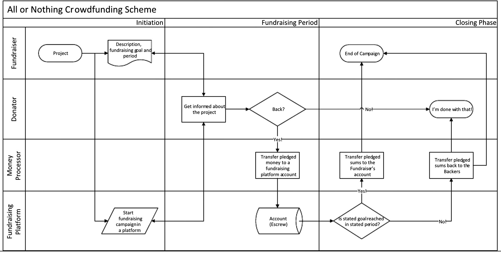

# fir_crowdfunding

## Реализация краудфандинга на базе смарт-контракта

### Алгоритм работы:

Смарт контракт начинает принимать криптовалюту с момента запуска кампании и заканчивая указанной датой. Каждый инвестор, отправивший на данный контракт средства, получает взамен токены.
В случае, если до крайнего срока **не** была собрана заранее запрограммированная сумма средств, инвесторы (владельцы токенов) могут вернуть их и получить назад свои инвестиции.
В случае, если необходимая сумма была собрана, она становится доступна к выводу заранее указанному субъекту, являющегося владельцем проекта. 
В дальнейшем владелец проекта имеет возможность запустить процесс обмена токенов на товары, использовать их для распределения дохода между инвесторами или применить в любом другом способе вознаграждения.
Инвесторы могут передавать токены друг другу, вместе с обязательствами владельца проекта по выплате вознаграждений.
  
  


## Установка

```
npm install
truffle build
```
  
## Запуск тестов

Предварительный запуск тестовой ноды:
```
ganache-cli
```

Тестирование:
```
truffle test
```
  
-----------------------------------------------------------  
